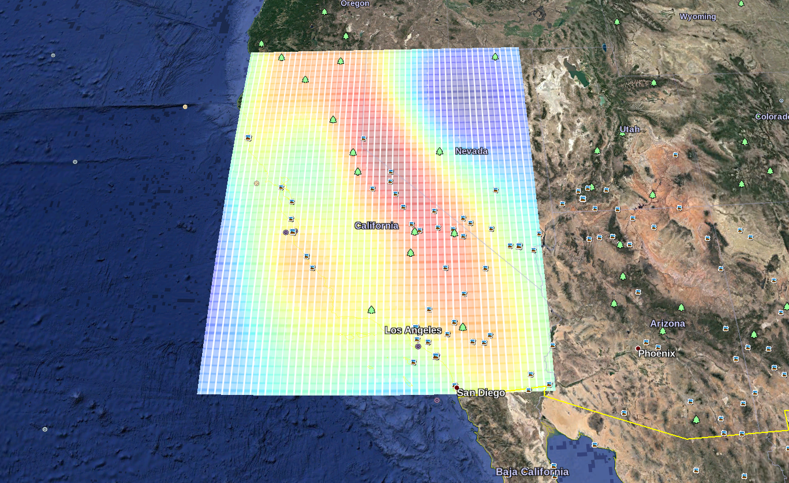

# Geostatistics

*Basic implementation of simple kriging predictions and stochastic simulations using Numpy,
along with methods for cross-validation and visualization.   
Civil & Environmental Engineering 263n: Scalable Spatial Analytics at UC-Berkeley, Fall 2016  
By Paul Sohn, October 26, 2016*

This Python module includes a basic implementation of a geostatistical predictive model 
(simple kriging, equivalent to Gaussian process regression) and methods for stochastic simulation
and visualization. The model is tested using rainfall measurements from 827 locations; 414 observations
are used as training data and the other 413 observations are used as test data. 

The `SimpleKriging` class provides methods for prediction and simulation, explored below:

## Prediction

The `SimpleKriging` class is instantiated with a training dataset. Predictions for a test dataset
are made according to:

$$m(f) = K(x_{test}, x) [K + \sigma_n^2 I]^{-1} y$$

where $K$ is a selected covariance function, $\sigma_n^2$ is a noise covariance value, and 
$x$, $x_{test}$, and $y$ are the vectors of training and test coordinates, and training rainfall
values, respectively. For my predictions, I use the simple squared exponential covariance function,
defined as:

$$
K_{SE}(x,x') = exp(- \frac{d^2}{2l^2})
$$

where $l$ is the characteristic length-scale of the Gaussian process.
The basic usage of the module to predict values is as follows.
First, we load the training and test data:

```
train = np.genfromtxt('data/train_data.csv', delimiter=',',skip_header=True)
test_raw = np.genfromtxt('data/test_data.csv', delimiter=',',skip_header=True)
test = test_raw[:,1:]
```

We then instantiate a model using the `SimpleKriging` class and predict values 
using the `SimpleKriging.predict` method, with some arbitrary values:

```
kriging = gaussian.SimpleKriging(training_data=train)
predict = kriging.predict(test_data=test, l=.5, sigma=.2)
predict[:5]

array([[ 70.94340417],
       [ 23.70437824],
       [ 49.57131344],
       [ 71.06713418],
       [ 70.69029366]])
```

How can we find better values for `l` and `sigma`? We can use the `cross_validation` function
to experimentally find values that minimize cross-validation error.

```
l_to_test = np.arange(0.7, 1.3, 0.05)[1:]
sigma_to_test = np.arange(0.16, 0.2, 0.005)[1:]  

l_opt, sigma_opt, func, rmse_low = gaussian.cross_validate(train,
                                                     l_values=l_to_test,
                                                     sigma_values=sigma_to_test,
                                                     rmse_opt=1000,
                                                     k_folds=5)
```

We get values of `l_opt = 1.05` and `sigma_opt = 0.195`, and we can substitute these in 
to the prediction above. This is what I used for my Kaggle submission.

## Simulation

We can generate stochastic simulations using these predictive values by adding a 
Cholesky decomposition to the predictive means and adding them to a self-defined grid.
The `SimpleKriging.simulate` method includes the ability to output an image and a .kml file
in order to visualize predictions in Google Earth:

